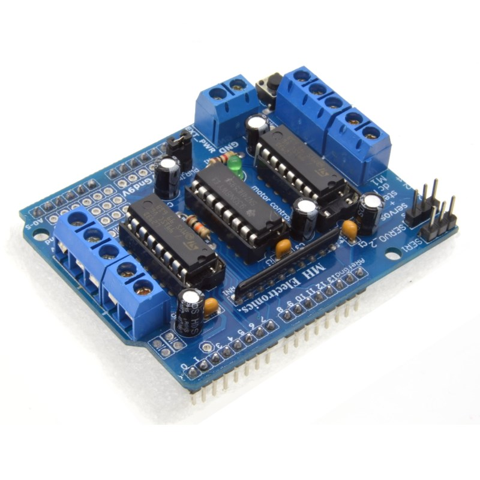

# Motor Control Shield

mBlock 3 Arduino extension to control motors with a shield using a shift register.

Not compatible with Scratch.

Compatible Arduino shield: [L293D motor control shield](https://www.aliexpress.com/item/Freeshipping-L293D-motor-control-shield-motor-drive-expansion-board-FOR-Arduino-motor-shield/32502816728.html)

